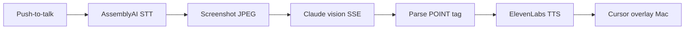
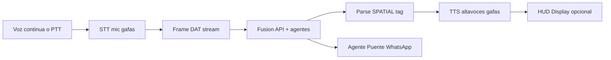

# Análisis: Clicky vs Puente — Qué copiar, qué cambiar, cómo diferenciarse

> **Repo analizado:** [farzaa/clicky](https://github.com/farzaa/clicky) (MIT, ~6.8k stars)  
> **Producto Clicky:** Compañero IA en Mac — ve tu pantalla, habla contigo, señala elementos con un cursor azul.  
> **Producto Puente:** Compañero IA en gafas Meta — ve tu POV egocéntrico, narra el espacio, ejecuta acciones sociales sin manos.

---

## 1. Qué es Clicky (en 30 segundos)

Clicky es una **app de barra de menú macOS** (sin icono en dock) que implementa un loop:

```
Push-to-talk (Ctrl+Option)
  → Mic → AssemblyAI streaming STT
  → Screenshot multi-monitor (ScreenCaptureKit)
  → Claude Sonnet/Opus (visión + streaming SSE)
  → ElevenLabs TTS
  → Cursor azul vuela a [POINT:x,y:label] en pantalla
```

Todo pasa por un **Cloudflare Worker** que guarda las API keys (`/chat`, `/tts`, `/transcribe-token`). El código nunca embarca secretos.

Fuente: [README](https://github.com/farzaa/clicky), [AGENTS.md](https://github.com/farzaa/clicky/blob/main/AGENTS.md).

---

## 2. Mapa de equivalencias Clicky → Puente

| Capa Clicky | Archivo / pieza | Equivalente Puente | ¿Reutilizar? |
|-------------|-----------------|-------------------|--------------|
| **Entrada voz** | `BuddyDictationManager` + AssemblyAI WS | Mic HFP gafas → STT (AssemblyAI o Whisper) | **Patrón sí**, código Swift no |
| **Entrada visión** | `CompanionScreenCaptureUtility` (JPEG pantalla) | DAT camera stream (504×896 @ 15fps) | **Concepto sí**, API distinta |
| **Cerebro** | `CompanionManager` (~1026 líneas) | `SessionManager` Kotlin + backend agentes | **Arquitectura sí**, lógica distinta |
| **Visión LLM** | `ClaudeAPI.analyzeImageStreaming` | `/fusion/describe` (Claude/GPT-4o) | **Casi copia** del cliente HTTP |
| **Salida voz** | `ElevenLabsTTSClient` → altavoces Mac | TTS → **altavoces gafas** vía DAT | **Copia directa** del worker + cliente |
| **Salida visual** | `OverlayWindow` + `[POINT:x,y:label]` | TTS espacial + HUD Display 600×600 | **Reemplazar**, no portar |
| **Proxy API** | `worker/src/index.ts` | `puente/backend/worker` | **Fork casi literal** |
| **Prompt sistema** | "you're clicky, friendly teacher..." | Prompts Sentido/Puente ES-MX accesibilidad | **Estructura sí, contenido 0%** |
| **UI** | Menu bar + panel flotante | App móvil minimal + companion web jurado | **No copiar** |

---

## 3. Pipeline lado a lado

### Clicky (Mac desktop)



### Puente (Ray-Ban Gen 2 / Display)



**Insight:** El **80% del loop cognitivo es idéntico**. Lo que cambia es *de dónde viene la imagen*, *cómo describes el espacio* y *qué haces además de hablar*.

---

## 4. Qué te ayuda Clicky concretamente

### 4.1 Copiar casi tal cual

#### A) Cloudflare Worker (`worker/src/index.ts`)

Tres rutas probadas en producción:

| Ruta | Upstream | Puente |
|------|----------|--------|
| `POST /chat` | Anthropic Messages streaming | Fusion + agentes |
| `POST /tts` | ElevenLabs | Salida gafas |
| `POST /transcribe-token` | AssemblyAI token 480s | STT mic gafas |

**Acción:** Fork a `puente/backend/worker/`. Añadir rutas `/fusion/describe` y `/agents/puente`.

#### B) Cliente Claude streaming (`ClaudeAPI.swift`)

Patrones útiles ya resueltos:
- Detección MIME JPEG vs PNG en base64
- TLS warmup (evita errores con payloads grandes)
- Parse SSE `content_block_delta`
- Historial de conversación multi-turn

**Acción:** Portar a Kotlin (Android) o reutilizar lógica en backend Bun/TS.

#### C) State machine (`CompanionManager`)

Estados: `idle → listening → processing → responding`

Puente necesita los mismos + `streaming_continuous` para Sentido:

```kotlin
enum class PuenteVoiceState {
    IDLE,
    LISTENING,      // PTT o wake
    PROCESSING,     // frame + STT → backend
    RESPONDING,     // TTS reproduciendo
    NAVIGATING      // Sentido continuo (cada N seg)
}
```

#### D) ElevenLabs TTS client

Clicky envía texto al worker, recibe MP3, reproduce con `AVAudioPlayer`.

En Puente: mismo flujo pero el audio va a **ruta de salida DAT speakers**, no al speaker del teléfono (documentar en DAT audio routing).

---

### 4.2 Inspiración de diseño (no código)

| Patrón Clicky | Aplicación Puente |
|---------------|-------------------|
| Respuestas cortas "for the ear" | Crítico para ciegos — no listas, no markdown |
| `[POINT:x,y:label]` al final del texto | Inventar `[SPATIAL:izq\|der\|adelante\|alerta:label]` |
| Conversación con memoria de sesión | "¿Qué dijiste hace un momento sobre el elevador?" |
| Worker sin keys en cliente | Obligatorio en app móvil publicada |
| Push-to-talk global shortcut | En gafas: botón temple o "Hey Puente" (custom, no Hey Meta) |

---

### 4.3 Lo que NO debes copiar

| Clicky | Por qué no aplica |
|--------|-------------------|
| `OverlayWindow` + cursor azul | No hay pantalla Mac; Gen 2 no tiene HUD |
| ScreenCaptureKit multi-monitor | POV egocéntrico 9:16 desde la frente |
| Coordenadas pixel `[POINT:1100,42:...]` | Usuario no ve pantalla; necesitas **lenguaje egocéntrico** |
| Persona "profesor de software" | Puente = **compañero de agencia**, no tutor |
| macOS menu bar + permisos TCC | Android DAT + Meta AI Developer Mode |
| Solo Q&A | Puente ejecuta **acciones** (WhatsApp, confirmar, dictar) |
| Audiencia general productiva | **Discapacidad funcional**, México/LATAM, Washington Group |
| Inglés casual lowercase | **Español MX**, formalidad accesible, disclaimers |

---

## 5. La diferenciación real (pitch vs Clicky)

| Dimensión | Clicky | Puente |
|-----------|--------|--------|
| **Metáfora** | Profesor al lado de tu cursor | Puente hacia personas y acciones |
| **Hardware** | Mac + pantallas | Gafas POV + teléfono + Display opcional |
| **Visión** | UI de escritorio (2D, multi-monitor) | Mundo físico egocéntrico (3D narrado) |
| **Output visual** | Cursor señala botones | **Solo TTS** (Gen 2); HUD en Display futuro |
| **Output acción** | Ninguna (solo explica) | WhatsApp, share, dictado, confirmación |
| **Modo continuo** | Solo on-demand PTT | Sentido: narración cada 3s caminando |
| **Mercado** | Devs/creators Mac global | 9.5M discapacidad MX, motriz > visual |
| **Competidor** | ChatGPT desktop, Copilot | Meta AI, Be My Eyes — pero con **agentes LATAM** |
| **Licencia** | MIT (puedes fork) | Fork worker + patterns; producto distinto |

**Frase diferenciadora:**

> Clicky enseña a usar lo que ya ves en tu Mac.  
> **Puente te devuelve agencia cuando tu cuerpo no alcanza** — caminar, saludar, escribir, oír — desde tu punto de vista, en español, con acciones reales.

---

## 6. Reemplazo del sistema `[POINT]` → `[SPATIAL]`

Clicky parsea al final de la respuesta:

```
[POINT:1100,42:color inspector]
```

Puente necesita tags **egocéntricos** (parseables por TTS y HUD):

```
[SPATIAL:derecha:elevador:distancia_media]
[SPATIAL:izquierda:terraza]
[SPATIAL:adelante:escaleras:bloqueado]
[SPATIAL:alerta:vehiculo]
[SPATIAL:none]
```

**TTS resultante (strip tags):**  
"A tu derecha, a unos tres metros, hay un elevador. A tu izquierda una terraza."

**HUD Display (structured):**

```json
{
  "line1": "Elevador →",
  "line2": "Terraza ←",
  "alert": false
}
```

Misma *idea* que Clicky (structured output al final), distinto *dominio*.

---

## 7. Prompt Clicky vs Prompt Puente (Sentido)

### Clicky (extracto real)

```
you're clicky, a friendly always-on companion...
default to one or two sentences...
if the user's question relates to what's on their screen, reference specific things...
format: [POINT:x,y:label]
```

### Puente Sentido (propuesto)

```
Eres Puente, un compañero de orientación espacial para personas con baja visión en México.
Hablas en español mexicano claro, frases cortas, sin listas ni markdown.
Todo se lee en voz alta — escribe como hablarías caminando con alguien.
Usa referencias egocéntricas: "a tu derecha", "a tu izquierda", "adelante", "detrás".
Prioriza seguridad: cruces, escalones, obstáculos → [SPATIAL:alerta:...]
No des instrucciones imposibles ("haz clic en..."). Sugiere acciones corporales ("puedes girar a la derecha").
Al final append [SPATIAL:...] tags según el esquema.
No sustituyes bastón ni perro guía. Eres apoyo complementario.
```

**Diferencia clave:** Clicky optimiza *aprendizaje de UI*. Puente optimiza *autonomía motriz y seguridad*.

---

## 8. Plan de fork pragmático

### Fase A — Backend (1 día)

```
puente/backend/worker/
  ├── index.ts          ← fork Clicky worker
  ├── fusion.ts         ← POST /fusion/describe (nuevo)
  └── agents/puente.ts  ← POST /agents/puente (nuevo)
```

### Fase B — Prototipo laptop (1–2 días, sin gafas)

Replicar loop Clicky pero con **webcam POV** en lugar de ScreenCaptureKit:

```
Webcam → mismo ClaudeAPI → TTS → speakers
Prompt Sentido + [SPATIAL]
```

Valida prompts antes de pelear con DAT Android.

### Fase C — Android DAT (3–4 días)

Portar solo:
- State machine (CompanionManager → SessionManager)
- Claude/ElevenLabs clients (Kotlin)
- Reemplazar screenshot por `StreamSession` frame callback

No portar: OverlayWindow, MenuBar, ScreenCaptureKit.

### Fase D — Display HUD (paralelo si hay hardware)

WebSocket recibe `HudPayload` — equivalente visual al cursor bubble de Clicky, pero en lente 600×600.

---

## 8.1 Matriz "copia vs original"

| Componente | % copiable de Clicky | Trabajo original Puente |
|------------|---------------------|-------------------------|
| Worker proxy | 95% | +2 rutas agentes |
| Claude streaming client | 80% | Kotlin port + fusion prompt |
| TTS pipeline | 90% | Routing audio a gafas |
| STT pipeline | 70% | Mic HFP 8kHz constraints |
| State machine | 60% | Modo continuo Sentido |
| System prompts | 0% | ES-MX accesibilidad |
| Output visual | 0% | SPATIAL + HUD |
| Acciones agente | 0% | Puente WhatsApp |
| App shell | 0% | DAT Android + Display Web |

---

## 9. Riesgos legales / éticos del fork

- **Licencia MIT:** Puedes fork, modificar, comercializar. Mantén copyright notice.
- **Marca:** No uses "Clicky", cursor azul, ni positioning de "AI teacher". Puente es producto distinto.
- **Accesibilidad:** Clicky no claim ADA/accesibilidad. Puente **sí** necesita disclaimers (no sustituye bastón, perro guía, SLT).
- **Farza cerró features nuevas:** El repo open source es snapshot; no esperes updates. Tu valor está en DAT + LATAM.

---

## 10. Conclusión ejecutiva

**Clicky es el blueprint perfecto del loop cognitivo** voz → visión → LLM → voz (+ señal estructurada), con worker proxy production-ready.

**Puente no es "Clicky en gafas".** Es:

1. **POV egocéntrico** en lugar de screenshot desktop  
2. **Lenguaje espacial** en lugar de coordenadas pixel  
3. **Agentes de acción** (Puente, Mano) en lugar de solo explicar  
4. **Modo continuo** para navegación  
5. **Modo continuo** para navegación (Gen 2 audio-only; ver [GEN2_PUENTE_IMPLEMENTACION.md](./GEN2_PUENTE_IMPLEMENTACION.md))  
6. **Mercado discapacidad LATAM** con datos INEGI/CEPAL  

**Gen 2 (tu hardware):** Ver guía dedicada [GEN2_PUENTE_IMPLEMENTACION.md](./GEN2_PUENTE_IMPLEMENTACION.md) — sin HUD, solo altavoces gafas + app DAT Android.

**Recomendación inmediata:** Fork `worker/` hoy. Prototipa Sentido con webcam + prompts `[SPATIAL]`. Luego conecta DAT Android reemplazando solo la fuente de imagen.

---

## Referencias

- [Clicky GitHub](https://github.com/farzaa/clicky)
- [ROADMAP_APP_PUENTE.md](./ROADMAP_APP_PUENTE.md)
- [MODULO_DISCAPACIDADES_MX_LATAM.md](./MODULO_DISCAPACIDADES_MX_LATAM.md)
- [Meta DAT Android](https://github.com/facebook/meta-wearables-dat-android)
