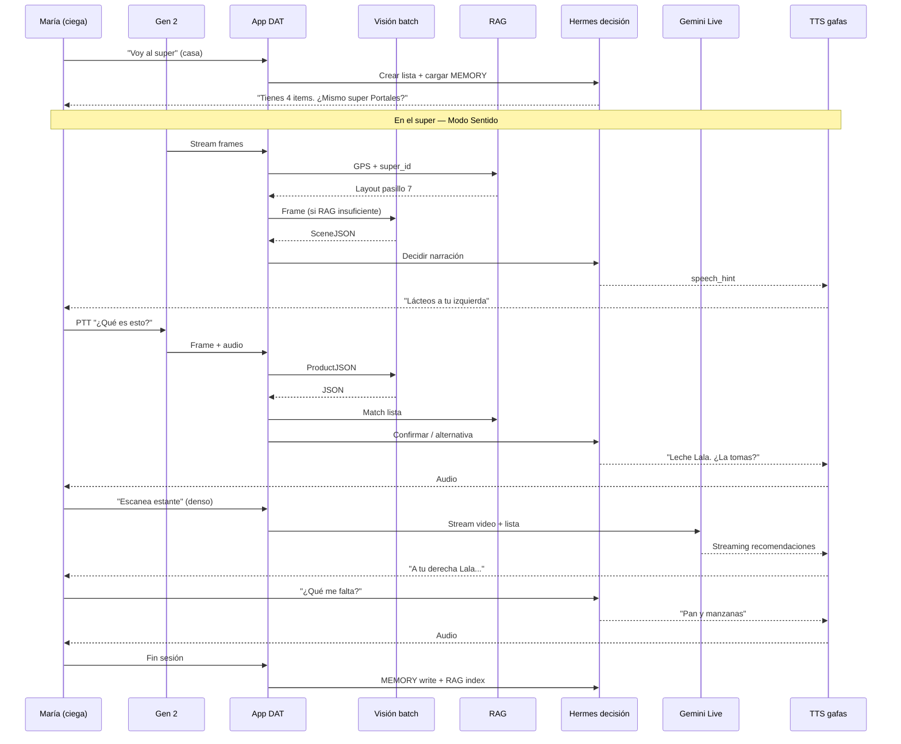

# Flujo E2E — Persona ciega en el super (Gen 2 + Puente)

> **Objetivo:** Especificar qué entra, qué sale, qué se espera y en cuánto tiempo — **sin código**.  
> **Hardware:** Ray-Ban Meta Gen 2 + app DAT + backend.  
> **Stack cognitivo:** Visión → JSON → almacenamiento → RAG → decisión ([Hermes Agent](https://github.com/NousResearch/hermes-agent)) + streaming ([Gemini Live](https://ai.google.dev/gemini-api/docs/live)) para recomendaciones en tiempo real.  
> **Migración memoria:** Patrones [OpenClaw](https://github.com/NousResearch/hermes-agent) → Hermes (`hermes claw migrate`: MEMORY.md, USER.md, skills).

---

## 1. Comparativa: con vs sin Puente

Escenario: **María**, 42 años, baja visión total. Lista: leche deslactosada, pan integral, manzanas, detergente. Super OXXO/Walmart MX, ~25 min.

| Momento | Sin Puente (baseline) | Con Puente (Gen 2) |
|---------|----------------------|---------------------|
| **Antes de salir** | Lista en Notes/voz; memoriza pasillos de visitas previas | Lista en app; Hermes carga MEMORY: "siempre leche Lala deslactosada", alergias, super favorito |
| **Entrada** | Bastón + orientación auditiva; pregunta a empleado dónde está carrito | Modo Sentido: "Adelante entrada. A tu derecha carritos." |
| **Ir a lácteos** | Tanteo paredes/estantes; 2–3 preguntas a personas | Stream continuo + RAG: "Pasillo 7, lacteos a tu izquierda" (si visitó antes) |
| **Encontrar leche** | Toca muchos envases; lee con app tercero (Be My Eyes, Seeing AI) — 30–90 s por producto | "¿Es leche deslactosada Lala?" → foto → JSON → TTS en 3–5 s |
| **Decidir alternativa** | Depende de ayuda externa o adivina | Hermes: "No hay Lala. ¿Aceptas Santa Clara deslactosada? Di sí o no." |
| **Precio / oferta** | No accesible o alguien le dice | JSON incluye `precio_visible`; TTS: "Cuesta 34 pesos" |
| **Cola / caja** | Pide ayuda para fila | Sentido: "Adelante fila corta, dos personas" |
| **Post-compra** | Olvida qué compró si no anotó | Sesión guardada; Hermes MEMORY: "compraste X el sábado" |

### Métricas comparativas (objetivo demo)

| Métrica | Sin Puente | Con Puente (objetivo) |
|---------|------------|------------------------|
| Preguntas a extraños / visita | 5–8 | 0–2 |
| Tiempo por producto (localizar + confirmar) | 2–4 min | 20–45 s |
| Errores de producto equivocado | 1–2 comunes | <1 (confirmación voz) |
| Autonomía percibida (escala 1–5) | 2 | 4 |
| Dependencia de manos para teléfono | Alta (saca app) | Baja (gafas + voz) |

**Disclaimer:** Puente no sustituye bastón, perro guía ni asistente humano en entornos complejos.

---

## 1.1 Tres escenarios de visita (matriz demo)

No es solo "con vs sin Puente": el sistema **evoluciona** y hay un tercer caso donde la persona **ya domina el super sin gafas** y prueba Gen 2 por primera vez en esa tienda.

| | **1ra visita** | **2da visita** | **Experta + gafas** |
|---|----------------|----------------|------------------------|
| **Contexto** | Nunca estuvo con Puente aquí | Volvió hace 5 días | 20+ visitas sin gafas; 1ra con Gen 2 |
| **RAG layout** | VACÍO | v1 · 85–90% hit | VACÍO en Puente · mapa mental en María |
| **¿Dónde leche?** | Solo visión ~4 s | RAG 0.3 s · skip visión | Valida ruta conocida + TTS |
| **Confirmar producto** | PTT ~8 s · indexa estante | Cache estante ~1.5 s | 8 s vs **3 min** tocando envases |
| **Flujos extra** | Entrada · explorar · PTT | RAG · PTT cache · alternativa · recall | Sin gafas vs con gafas · delta |
| **Preguntas extraños** | 4–6 | 0–1 | 0 |
| **Valor** | Puente aprende el super | Compra más rápida | Manos libres + precio sin tacto |

### Sub-flujos por escenario

**1ra visita**
1. Entrada — RAG miss → visión → indexa `layout_super v1`
2. ¿Dónde leche? — 100% visión · guía exploratoria
3. Confirmar PTT — ProductJSON · guarda `shelf_snapshots`

**2da visita**
1. ¿Dónde? → **RAG hit** — pasillo 7 sin visión
2. PTT estante conocido — **dedup** embedding visita 1
3. No hay Lala — Gemini Live + Hermes alternativa
4. ¿Qué me falta? — Hermes Session + RAG siguiente paso

**Experta + gafas**
1. Rutina sin gafas — bastón · tacto · 2–4 min/producto
2. Misma ruta con gafas — Puente aprende mientras ella ya sabe
3. Mismo momento — 180 s sin gafas vs 8 s con PTT

Canvas interactivo: [flujo-super-persona-ciega.canvas.tsx](/Users/chasse/.cursor/projects/Users-chasse-hackplatanus/canvases/flujo-super-persona-ciega.canvas.tsx)

---

## 2. Arquitectura de capas (vista general)

```
┌─────────────────────────────────────────────────────────────────────────┐
│ CAPA 0 — PERCEPCIÓN (Gen 2 DAT)                                         │
│ Entrada: video stream, mic, GPS, timestamp, session_id                  │
│ Salida: frames sampleados, audio chunks, ubicación aproximada           │
└───────────────────────────────┬─────────────────────────────────────────┘
                                ▼
┌─────────────────────────────────────────────────────────────────────────┐
│ CAPA 1 — VISIÓN ESTRUCTURADA (batch)                                    │
│ Entrada: JPEG frame + contexto (lista, pasillo estimado)                │
│ Salida: SceneJSON (ver §4)                                              │
│ Modelo: GPT-4o mini / Claude / Gemini Flash (no Live)                   │
└───────────────────────────────┬─────────────────────────────────────────┘
                                ▼
┌─────────────────────────────────────────────────────────────────────────┐
│ CAPA 2 — ALMACENAMIENTO                                                 │
│ • Session store (SQLite / blob): frames, JSON, transcript               │
│ • Vector store (RAG): embeddings de estantes, productos, layout super   │
│ • Hermes MEMORY.md / USER.md: preferencias, historial compras           │
└───────────────────────────────┬─────────────────────────────────────────┘
                                ▼
┌─────────────────────────────────────────────────────────────────────────┐
│ CAPA 3 — RAG (optimización de peticiones)                               │
│ Entrada: query ("leche deslactosada") + GPS + último SceneJSON          │
│ Salida: contexto comprimido — evita re-analizar mismo estante           │
└───────────────────────────────┬─────────────────────────────────────────┘
                                ▼
┌─────────────────────────────────────────────────────────────────────────┐
│ CAPA 4 — DECISIÓN (Hermes / OpenClaw patterns)                          │
│ Loop Think → Act → Observe: confirmar, alternativa, siguiente ítem      │
│ Memoria: "recordar" preferencias, sesiones previas, skills "super-run"    │
└───────────────────────────────┬─────────────────────────────────────────┘
                                ▼
┌─────────────────────────────────────────────────────────────────────────┐
│ CAPA 5 — TIEMPO REAL (Gemini Live) — solo cuando hace falta             │
│ Entrada: stream video + audio bidireccional                             │
│ Salida: recomendaciones continuas mientras camina o escanea estante     │
└───────────────────────────────┬─────────────────────────────────────────┘
                                ▼
┌─────────────────────────────────────────────────────────────────────────┐
│ CAPA 6 — SALIDA USUARIO                                                 │
│ TTS → altavoces gafas · vibración alerta · companion-web (jurado)       │
└─────────────────────────────────────────────────────────────────────────┘
```

---

## 3. Fases del journey (E2E)

### Fase A — Pre-compra (en casa)

| Paso | Actor | Entrada | Salida | Tiempo esperado |
|------|-------|---------|--------|-----------------|
| A1 | Usuario | Voz: "Voy al super, necesito leche, pan, manzanas" | Lista estructurada | Instantáneo local |
| A2 | Hermes | Lista + USER.md | Plan de ruta sugerido si hay historial | 1–2 s |
| A3 | Hermes MEMORY | Write: ítems pendientes, super destino | MEMORY actualizado | <1 s |

**Qué se espera:** María dice su lista una vez; no repite en el super.

---

### Fase B — Llegada y orientación (Modo Sentido)

| Paso | Actor | Entrada | Salida | Tiempo esperado |
|------|-------|---------|--------|-----------------|
| B1 | DAT | Stream MEDIUM @ 7fps, sample 1/3s | Frame JPEG | Continuo |
| B2 | Visión batch | Frame + GPS | SceneJSON `tipo: entrada` | 2–4 s por sample |
| B3 | RAG | GPS + super_id conocido | "Entrada Walmart Portales, pasillo 1 adelante" | 200–500 ms |
| B4 | Decisión | SceneJSON + RAG | TTS: narración espacial | +0.5 s TTS |
| B5 | Almacén | Frame hash + JSON | Guardado sesión (dedup) | Async |

**Qué escucha María:**  
"Adelante la entrada. A tu derecha hay carritos. Sigue derecho unos diez pasos."

**Cuándo NO llamar visión:** Si RAG tiene layout del mismo super y GPS coincide → solo TTS desde memoria (ahorro API).

---

### Fase C — Navegar a pasillo (RAG + Sentido)

| Paso | Actor | Entrada | Salida | Tiempo esperado |
|------|-------|---------|--------|-----------------|
| C1 | Usuario | "¿Dónde está la leche?" | Intent: `buscar_producto:leche` | STT 0.5–1 s |
| C2 | RAG | Query + MEMORY + mapa super | Chunk: "Lácteos pasillo 7, izquierda" | 300 ms |
| C3 | Sentido | Stream continuo | SceneJSON `pasillo`, obstáculos | 2–4 s / frame |
| C4 | Hermes | Lista pendiente + posición | Decisión: "Siguiente: girar izquierda en 5 m" | 1–2 s |
| C5 | Salida | Texto limpio | TTS gafas | 1–2 s reproducción |

**Optimización RAG:** Primera visita al super = más llamadas visión. Visitas 2+ = RAG responde layout; visión solo confirma "¿sigo en pasillo 7?" cada 10–15 s.

---

### Fase D — Identificar producto (on-demand + JSON)

| Paso | Actor | Entrada | Salida | Tiempo esperado |
|------|-------|---------|--------|-----------------|
| D1 | Usuario | PTT temple: "¿Qué producto es este?" | Transcript | 1 s |
| D2 | DAT | `capturePhoto()` o último frame | JPEG alta calidad | 200–400 ms |
| D3 | Visión | Frame + ítem buscado (RAG) | **ProductJSON** (§4.2) | 2–5 s |
| D4 | Hermes | ProductJSON + lista + alergias USER | Decisión: match / no match / alternativa | 1–3 s |
| D5 | Almacén | ProductJSON + embedding | Index RAG producto-estante | Async |
| D6 | Salida | Speech corto | TTS: "Es leche Lala deslactosada un litro. ¿La tomas?" | 2 s |

**Qué se espera:** Respuesta en **≤8 s** desde que suelta el botón (objetivo hackathon). Alerta si latencia >12 s: "Un momento, sigo analizando."

---

### Fase E — Decisión y memoria (Hermes / OpenClaw)

| Paso | Actor | Entrada | Salida | Tiempo esperado |
|------|-------|---------|--------|-----------------|
| E1 | Hermes loop | ProductJSON, USER.md, MEMORY | Tool call: `memory_search` "leche preferida" | 500 ms |
| E2 | Decisión | No match stock | "No hay tu marca. ¿Alternativa Santa Clara?" | 1 s |
| E3 | Usuario | "Sí" / "No" | STT confirmación | 1 s |
| E4 | Hermes | Confirmación | Update lista: leche ✓; MEMORY write | 1 s |
| E5 | Recall | "¿Qué me falta?" | Lee lista pendiente desde sesión | <1 s |

**Rol OpenClaw → Hermes:** OpenClaw aportaba SOUL.md, memoria conversacional, skills. Hermes unifica:
- **MEMORY.md** — hechos ("compra leche Lala", "super Portales pasillo 7")
- **USER.md** — perfil ("celíaca", "prefiere audio corto")
- **Skills** — `super-shopping-mx` (procedimiento reusable)
- **Session FTS5** — "¿Qué compré el sábado pasado?"

No necesitas correr Hermes completo en el teléfono: el **backend expone el mismo contrato** (memoria + loop decisión) inspirado en `run_agent.py`.

---

### Fase F — Recomendaciones tiempo real (Gemini Live)

**Cuándo activar Live vs batch:**

| Situación | Modo | Por qué |
|-----------|------|---------|
| Caminar pasillo vacío | Sentido batch 1 frame/3s | Suficiente, barato |
| Estante denso, muchos productos similares | **Gemini Live** stream | Audio continuo mientras panea |
| Cruce / escalones / carrito | Live o alerta priorit | Latencia mínima |
| Confirmar 1 producto | Batch JSON | Precisión > velocidad |
| Cola checkout | Batch | Bajo cambio visual |

| Paso | Actor | Entrada | Salida | Tiempo esperado |
|------|-------|---------|--------|-----------------|
| F1 | App | Toggle "Escaneo estante" | WebSocket Gemini Live | 1–2 s connect |
| F2 | DAT | Stream LOW/MEDIUM → Live API | Audio + texto streaming | **<1 s** first token |
| F3 | Live | Video + "busco leche deslactosada" | "A tu derecha fila Lala... más arriba Alpura..." | Continuo |
| F4 | Almacén | Resumen Live al cerrar | SceneJSON agregado → RAG | Post-session |

**Qué se espera:** Gemini Live para **exploración activa** del estante; batch JSON para **confirmación** antes de meter al carrito.

---

### Fase G — Checkout y cierre

| Paso | Entrada | Salida | Tiempo |
|------|---------|--------|--------|
| G1 | Stream | SceneJSON `filas`, `personas` | TTS fila |
| G2 | Usuario | "¿Cuánto llevo?" | Hermes lee lista ✓ + estimado si hubo precios |
| G3 | Fin | Session completa | Hermes MEMORY: resumen compra + embeddings RAG |

---

## 4. Contratos de datos (JSON)

### 4.1 SceneJSON (visión batch — pasillo / navegación)

```json
{
  "schema_version": "1.0",
  "timestamp": "2026-06-20T14:32:01Z",
  "session_id": "uuid",
  "frame_id": "f_0042",
  "gps": { "lat": 19.39, "lng": -99.17, "accuracy_m": 8 },
  "super_id": "walmart_portales",
  "scene_type": "pasillo",
  "spatial": {
    "adelante": { "label": "pasillo largo", "distancia": "media", "transitable": true },
    "izquierda": { "label": "estantes lacteos", "distancia": "cerca" },
    "derecha": { "label": "estantes cereales", "distancia": "cerca" },
    "alerta": null
  },
  "personas": 2,
  "iluminacion": "buena",
  "confianza": 0.82,
  "speech_hint": "Pasillo de lacteos a tu izquierda. Camino despejado adelante."
}
```

### 4.2 ProductJSON (confirmación producto)

```json
{
  "schema_version": "1.0",
  "timestamp": "2026-06-20T14:35:22Z",
  "frame_id": "f_0089",
  "producto": {
    "nombre": "Leche deslactosada",
    "marca": "Lala",
    "presentacion": "1 L",
    "categoria": "lacteos",
    "precio_visible": 34.50,
    "moneda": "MXN",
    "codigo_barras_visible": false
  },
  "match_lista": {
    "item_buscado": "leche deslactosada",
    "match": true,
    "score": 0.91
  },
  "alternativas_visibles": [
    { "marca": "Alpura", "match_parcial": true }
  ],
  "confianza": 0.88,
  "speech_hint": "Es leche Lala deslactosada de un litro. ¿La tomas?"
}
```

### 4.3 SessionState (Hermes / decisión)

```json
{
  "session_id": "uuid",
  "usuario_id": "maria_42",
  "lista_compra": [
    { "item": "leche deslactosada", "status": "pending", "preferencia": "Lala" },
    { "item": "pan integral", "status": "pending" },
    { "item": "manzanas", "status": "pending" }
  ],
  "ubicacion_estimada": "pasillo_7_lacteos",
  "items_en_carrito": [],
  "turno_actual": "confirmar_leche",
  "memoria_refs": ["MEMORY:pref_leche_lala", "RAG:super_portales_layout"]
}
```

---

## 5. RAG — qué se indexa y cómo optimiza

### 5.1 Colecciones

| Colección | Contenido | Uso |
|-----------|-----------|-----|
| `layout_super` | Pasillos, categorías, GPS bbox | "¿Dónde está X?" sin visión |
| `shelf_snapshots` | Embedding + ProductJSON + frame_id | "¿Ya vi este estante?" |
| `productos_usuario` | Historial compras María | Preferencias, marcas |
| `session_transcripts` | Voz + decisiones | Recall "qué dije" |
| `skills` | Procedimiento `super-shopping-mx` | Reduce tokens prompt |

### 5.2 Reglas de optimización (cuándo NO llamar visión)

```
SI query es navegación Y RAG.layout_super.confianza > 0.85 Y GPS en bbox
  → respuesta desde RAG (300 ms)

SI último SceneJSON.hace < 5s Y frame_hash similar (±5%)
  → reutilizar JSON (0 ms visión)

SI usuario confirma producto Y ProductJSON.confianza > 0.9
  → skip re-análisis

SI estante denso Y usuario en modo "escaneo"
  → activar Gemini Live (no batch cada 3s)
```

**Ahorro estimado:** Visita 2 al mismo super → **−60% llamadas visión**.

---

## 6. Hermes + OpenClaw — memoria y decisión

### 6.1 División de responsabilidades

| Componente | Función en el super |
|------------|---------------------|
| **USER.md** | Perfil: ceguera total, alergias, idioma ES-MX, velocidad TTS |
| **MEMORY.md** | Hechos: "compra Lala", "super favorito Portales", "evita marcas X" |
| **Skills** | `super-shopping-mx`: pasos estándar (lista → pasillo → confirmar → carrito) |
| **Session DB** | Turnos de hoy, FTS5 "recordar sábado" |
| **Honcho / provider externo** (opcional) | Modelo de usuario dialéctico — preferencias implícitas |
| **OpenClaw migrate** | Importar memoria previa si ya usaban OpenClaw |

### 6.2 Loop de decisión (Think → Act → Observe)

```
OBSERVE: SceneJSON + ProductJSON + lista + RAG context
THINK:   ¿Match? ¿Alternativa? ¿Siguiente ítem? ¿Alerta?
ACT:     speak(TTS) | ask_confirm | update_lista | memory_write
```

**Ejemplos de decisiones:**

| Condición | Acción |
|-----------|--------|
| match && confianza > 0.85 | "¿La tomas?" → esperar sí/no |
| !match && alternativas | "No está Lala. ¿Alpura?" |
| alerta en spatial | Interrumpir TTS: "Cuidado, carrito adelante" |
| lista completa | "Listo. Falta pagar. ¿Vamos a caja?" |
| usuario: "recuérdame" | MEMORY write + confirmación voz |

---

## 7. Gemini Live — rol en recomendaciones

### 7.1 Flujo Live

```
DAT stream (7–15 fps) ──WebSocket──► Gemini Live API
Mic gafas ────────────────────────► (audio input)
Context RAG (lista, pasillo) ─────► system instruction

◄── Audio streaming TTS nativo Live
◄── Texto parcial (logs / companion-web)
```

### 7.2 System instruction (borrador)

```
Eres guía de compras para persona ciega en México.
Describe en español claro, egocéntrico, frases cortas.
El usuario busca: {items_pendientes}.
Prioriza: seguridad > producto correcto > precio.
Si no estás seguro, pide que acerque el producto o use el botón confirmar.
```

### 7.3 Batch vs Live — matriz

| Necesidad | Batch JSON | Gemini Live |
|-----------|------------|-------------|
| ¿Qué hay adelante caminando? | Sí (cada 3s) | Opcional |
| ¿Cuál de estos 10 envases es leche? | Confirmación final | **Sí** mientras panea |
| ¿Cuánto cuesta? | Sí (OCR precio) | Sí si precio visible |
| Recordar preferencias | Hermes RAG | Context injection |
| Latencia first response | 2–5 s | **0.5–1 s** |

---

## 8. Diagrama E2E completo



---

## 9. SLAs de tiempo de respuesta (objetivos)

| Evento | Target | Máximo aceptable | Fallback |
|--------|--------|------------------|----------|
| STT fin PTT | 0.8 s | 1.5 s | Repetir "no te escuché" |
| RAG hit layout | 0.3 s | 0.8 s | Visión batch |
| SceneJSON (batch) | 3 s | 6 s | "Sigo analizando" + frame previo |
| ProductJSON | 4 s | 8 s | "Acerca más el producto" |
| Hermes decisión | 1.5 s | 3 s | Regla hardcoded match |
| TTS first audio | 0.5 s | 1 s | Android TTS local |
| Gemini Live connect | 1.5 s | 3 s | Degradar a batch |
| Gemini Live first token | 0.8 s | 2 s | — |
| Sentido continuo ciclo | 3 s/frame | 5 s | Saltar frame |
| Alerta seguridad | **<2 s total** | 3 s | Vibración teléfono |

**Latencia end-to-end PTT "¿qué es esto?":** **≤8 s** (target demo), **≤12 s** (producción v1).

---

## 10. Entradas y salidas por capa

| Capa | Entradas | Salidas |
|------|----------|---------|
| **DAT** | temple, voz, BT stream | JPEG, PCM audio, device state |
| **Visión batch** | JPEG, context, lista | SceneJSON / ProductJSON |
| **Almacén** | JSON, frames, transcripts | Blobs, SQLite, vectors |
| **RAG** | query, GPS, session | chunks + score |
| **Hermes** | JSON + memoria + lista | acción, speech_hint, memory ops |
| **Gemini Live** | video stream, audio, context | audio stream, texto parcial |
| **Salida** | speech_hint | TTS gafas, vibración |

---

## 11. Modos de la app durante el super

| Modo | Cuándo | Stream | APIs activas |
|------|--------|--------|--------------|
| **Idle** | En casa / pausa | Off | Hermes only |
| **Sentido** | Caminar | On 1/3s | Batch + RAG |
| **Consulta** | PTT pregunta | Snapshot | Batch + Hermes |
| **Escaneo** | Estante denso | On full | **Gemini Live** |
| **Confirmación** | Antes de carrito | Photo | ProductJSON + Hermes |
| **Alerta** | Obstáculo | Priority | Batch fast + vibración |

---

## 12. Qué construir primero (orden lógico)

1. **SceneJSON + ProductJSON** — contrato visión (batch)
2. **Session store** — guardar frames + JSON por visita
3. **RAG layout** — manual primer super + embeddings shelf
4. **Hermes-lite** — MEMORY/USER + loop confirmación lista
5. **Sentido TTS** — narración desde JSON
6. **Gemini Live** — solo modo Escaneo
7. **Comparativa demo** — misma ruta con/sin tool (video jurado)

---

## 13. Demo hackathon sugerida

**Acto 1 — Sin Puente (30 s video):** María pregunta a 2 personas, toca 5 envases, tarda 3 min en leche.

**Acto 2 — Con Puente:**  
1. "Modo super" → Sentido al pasillo  
2. PTT "¿Qué es esto?" → ProductJSON → confirmación  
3. "¿Qué me falta?" → Hermes recall  
4. Companion-web muestra JSON + RAG hit en proyector  

---

## Referencias

- [GEN2_PUENTE_IMPLEMENTACION.md](./GEN2_PUENTE_IMPLEMENTACION.md)
- [MODULO_DISCAPACIDADES_MX_LATAM.md](./MODULO_DISCAPACIDADES_MX_LATAM.md)
- [Hermes Agent](https://github.com/NousResearch/hermes-agent) — memoria, skills, `hermes claw migrate`
- [Hermes Memory](https://hermes-agent.nousresearch.com/docs/user-guide/features/memory)
- [Gemini Live API](https://ai.google.dev/gemini-api/docs/live)
- [Meta DAT Camera](./CAMARA_META_RAYBAN.md)
