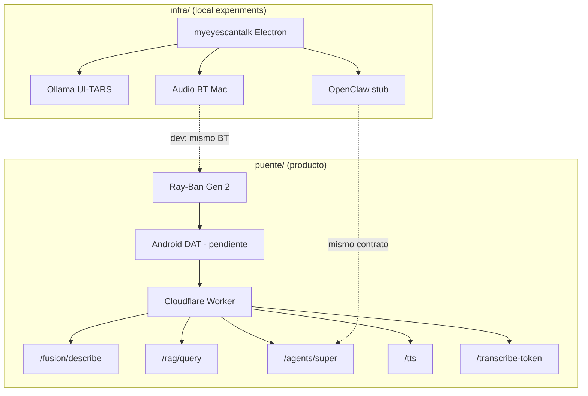

# Análisis de infraestructura — `infra/` + Puente

> **Ubicación:** `/Users/chasse/hackplatanus/infra/`  
> **Clonado:** [una-linea-a-la-vez/myeyescantalk](https://github.com/una-linea-a-la-vez/myeyescantalk)  
> **Estado Puente worker:** `puente/backend/worker/` — **wrangler dev** en `:8787` (fusion probado)

---

## 1. Qué hay en `infra/` hoy

```
hackplatanus/infra/
└── myeyescantalk/          ← único repo clonado (57 objetos, ~72 KB)
    ├── electron/           ← app macOS Phase 1
    ├── openclaw-plugin/    ← stub agente OpenClaw
    ├── scripts/            ← ollama, audio, model download
    └── assets/

Intentos fallidos / cancelados (terminal):
  hermes-agent/             ← clone interrumpido (^C) — no existe local
```

---

## 2. My Eyes Can Talk — qué es

| Atributo | Valor |
|----------|-------|
| **Producto** | Asistente voz-first para ciegos en **macOS** |
| **Fase** | **Phase 1** — scaffold + mocks |
| **Runtime** | Electron 27 + TypeScript |
| **Visión (plan)** | Ollama + **UI-TARS-7B** local (multimodal, requiere `.mmproj`) |
| **STT/TTS (plan)** | whisper.cpp + Piper (Phase 2, no implementado) |
| **Agente (plan)** | OpenClaw SDK (Phase 2) |
| **Audio** | `system_profiler` → detecta BT (Ray-Ban/ACCENTUM) vs built-in |

### Loop actual (Phase 1 — mock)

```
Boot → detectAudio(BT) → healthChecks(mock)
  → VoiceLoop → MockAgent → log [SPEAK] (no TTS real)
```

**No hay:** cámara, DAT, Gen 2, cloud worker, RAG, super, frames JPEG.

---

## 3. Puente backend — qué ya tenemos (más avanzado)

Ubicación: `puente/backend/worker/src/index.ts`

| Ruta | Estado | Origen |
|------|--------|--------|
| `POST /chat` | OK | Fork Clicky |
| `POST /tts` | OK | Clicky + `eleven_multilingual_v2` + stream |
| `POST /transcribe-token` | OK | Clicky / AssemblyAI |
| `POST /fusion/describe` | **Implementado** | Sentido + ProductJSON · Claude |
| `POST /rag/query` | **Implementado** | MVP in-memory `walmart_portales` |
| `POST /agents/super` | **Implementado** | Hermes-lite vía Claude |

Evidencia terminal: curl a `localhost:8787/fusion/describe` respondió `{ "error": "Falta image_base64" }` — **worker vivo**.

Config:
- Secrets en `.dev.vars` (no commitear)
- `wrangler.toml` — nombre aún `clicky-proxy` (renombrar a `puente-worker`)

---

## 4. Mapa: dos arquitecturas distintas

```
┌─────────────────────────────────────────────────────────────────┐
│  MYEYESCANTALK (infra/) — laptop macOS                           │
│  Mic/Speaker BT ─► whisper ─► Ollama UI-TARS ─► Piper ─► speaker │
│  OpenClaw agent (Phase 2) · Electron · TODO local/offline        │
└─────────────────────────────────────────────────────────────────┘
                              ≠
┌─────────────────────────────────────────────────────────────────┐
│  PUENTE (puente/) — Gen 2 + Android DAT                          │
│  Gafas POV/mic ─► App DAT ─► Cloudflare Worker ─► Claude/ElevenLabs│
│  RAG + Hermes-lite · frames JPEG · super demo                    │
└─────────────────────────────────────────────────────────────────┘
```

| Dimensión | myeyescantalk | Puente |
|-----------|---------------|--------|
| Hardware target | Mac + BT headset | Ray-Ban Gen 2 + Android |
| Visión | Ollama UI-TARS local | Claude cloud `/fusion/describe` |
| Cámara | Phase 2 screen reader / ? | DAT POV stream |
| Agente | OpenClaw (stub) | Hermes-lite en worker |
| TTS | Piper local (Phase 2) | ElevenLabs stream → gafas |
| STT | whisper.cpp (Phase 2) | AssemblyAI |
| Offline | Objetivo sí | No (cloud) |
| Super / RAG | No | Sí |

**Conclusión:** No son el mismo producto. **Puente worker ya es el cerebro cloud.** myeyescantalk es un experimento **macOS local** complementario.

---

## 5. Qué reutilizar de myeyescantalk en Puente

| Pieza | Archivo | Reuso Puente |
|-------|---------|--------------|
| **Detección audio BT** | `electron/audio-router.ts` | Dev Mac: probar routing Ray-Ban emparejado al laptop |
| **Voice loop pattern** | `electron/voice-loop.ts` | Patrón STT→agent→TTS (adaptar a worker HTTP) |
| **Supervisor procesos** | `electron/supervisor.ts` | Sidecars: ollama local, wrangler dev |
| **Agent interface** | `openclaw-plugin/agent-interface.ts` | Contrato `sendToAgent(text)→string` = `/agents/super` |
| **Boot + health** | `electron/boot-sequence.ts` | App Android: permisos DAT + worker ping |
| **Config persist** | `~/.myeyescantalk/config.json` | Similar `SessionState` en app |
| **Logger** | `electron/logger.ts` | Debug companion jurado |

### No reutilizar directo

| Pieza | Por qué |
|-------|---------|
| UI-TARS + Ollama | Puente usa Claude cloud; latencia/SLA ya definidos |
| Electron main | Producto es Android DAT |
| MockAgent | Reemplazado por `/agents/super` |
| Screen reader macOS | No aplica a POV gafas |

---

## 6. OpenClaw / Hermes — dónde encajan

| Repo | Rol en Puente | Estado |
|------|---------------|--------|
| **myeyescantalk/openclaw-plugin** | Stub `Agent.sendToAgent` | Phase 2 myeyescantalk |
| **Hermes Agent** (clone cancelado) | Memoria MEMORY.md, skills, loop | Patrones en worker `/agents/super` |
| **Puente worker** | Hermes-lite implementado | **Ya corre** |

Migración OpenClaw → Hermes (oficial): `hermes claw migrate` — solo si ya usaban OpenClaw en prod.

Para hackathon: **worker `/agents/super` + `shared/hermes/`** es suficiente.

---

## 7. Infraestructura recomendada (consolidada)

```
                    DESARROLLO (Mac equipo)
┌──────────────────────────────────────────────────────────┐
│  wrangler dev :8787          ← puente/backend/worker      │
│  myeyescantalk (opcional)    ← probar audio BT en laptop  │
│  companion M1 (opcional)     ← /Users/chasse/hack M1      │
└────────────────────────────┬─────────────────────────────┘
                             │ HTTPS
┌────────────────────────────▼─────────────────────────────┐
│  PRODUCCIÓN                                               │
│  Cloudflare Workers (deploy)                              │
│  Secrets: ANTHROPIC, ASSEMBLYAI, ELEVENLABS               │
└────────────────────────────┬─────────────────────────────┘
                             │
┌────────────────────────────▼─────────────────────────────┐
│  RUNTIME USUARIO                                          │
│  Android DAT app  ←→  Ray-Ban Meta Gen 2                  │
└──────────────────────────────────────────────────────────┘
```

### Servicios cloud (Puente — activos)

| Servicio | Uso | Config |
|----------|-----|--------|
| Cloudflare Worker | API gateway | `wrangler.toml` + secrets |
| Anthropic | Visión + Hermes | `ANTHROPIC_API_KEY` |
| AssemblyAI | STT | `ASSEMBLYAI_API_KEY` |
| ElevenLabs | TTS ES-MX | `ELEVENLABS_*` |

### Servicios local (myeyescantalk — opcional dev)

| Servicio | Uso | Comando |
|----------|-----|---------|
| Ollama | UI-TARS offline | `ollama serve` + `npm run download:model` |
| whisper.cpp | STT offline | Phase 2 |
| Piper | TTS offline | Phase 2 |

---

## 8. Gaps — qué falta construir

| # | Gap | Prioridad | Dónde |
|---|-----|-----------|-------|
| 1 | **App Android DAT** | P0 | `puente/apps/mobile/` — no existe |
| 2 | Renombrar worker `clicky-proxy` → `puente` | P2 | `wrangler.toml` |
| 3 | RAG vector store real (hoy in-memory) | P2 | Worker o SQLite |
| 4 | Indexación post-sesión visita 1 | P2 | Backend + app |
| 5 | Hermes clone completo | P3 | Opcional; worker basta |
| 6 | myeyescantalk Phase 2 | P3 | Solo si quieren demo Mac offline |
| 7 | Gemini Live escaneo estante | P2 | Worker route o directo app |

---

## 9. Comandos útiles

### Puente worker (principal)

```bash
cd /Users/chasse/hackplatanus/puente/backend/worker
npm install
npx wrangler dev                    # localhost:8787

# Test fusion (con frame.jpg en hackplatanus/)
B64=$(base64 -i /Users/chasse/hackplatanus/frame.jpg)
curl -s localhost:8787/fusion/describe \
  -H 'content-type: application/json' \
  -d "{\"image_base64\":\"$B64\",\"module\":\"producto\",\"item_buscado\":\"leche deslactosada\",\"marca_preferida\":\"Lala\"}" | jq

# Test RAG hit (2da visita)
curl -s localhost:8787/rag/query \
  -H 'content-type: application/json' \
  -d '{"query":"leche","super_id":"walmart_portales"}' | jq
```

### myeyescantalk (secundario / audio BT test)

```bash
cd /Users/chasse/hackplatanus/infra/myeyescantalk
npm install
npm run build:ts
npm run test:audio          # detecta BT Ray-Ban en Mac
npm run check:ollama
npm run dev                 # mock voice loop
```

---

## 10. Decisión para el equipo

| Pregunta | Respuesta |
|----------|-----------|
| ¿Usamos myeyescantalk como app principal? | **No** — es Mac/Electron Phase 1 mock |
| ¿Usamos su infra cloud? | **No tiene** — Puente worker sí |
| ¿Clonamos Hermes completo? | **No necesario** — `/agents/super` + templates |
| ¿Qué hacer con `infra/myeyescantalk`? | **Referencia** audio BT + OpenClaw stub; opcional dev tool |
| ¿Qué construir ahora? | **Android DAT** conectado a worker `:8787` |

---

## 11. Diagrama relación repos



---

## Referencias

- [myeyescantalk README](./myeyescantalk/README.md)
- [puente/CLAUDE.md](../puente/CLAUDE.md)
- [puente/CHECKLIST.md](../puente/CHECKLIST.md)
- [FLUJO_SUPER_PERSONA_CIEGA.md](../FLUJO_SUPER_PERSONA_CIEGA.md)
